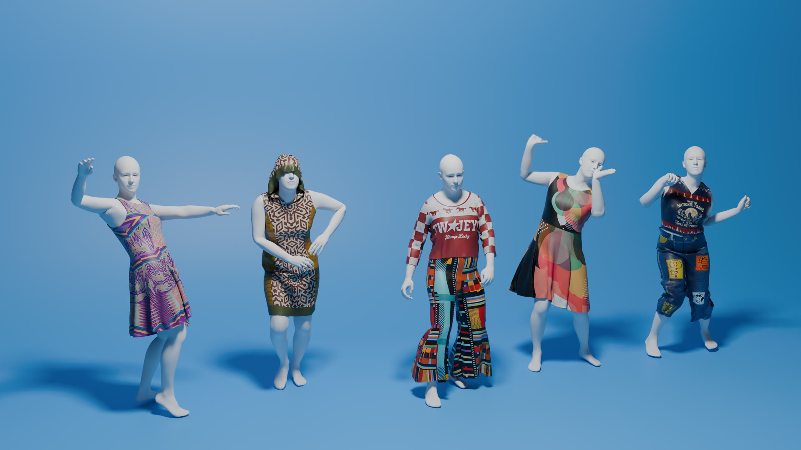

# OmniFabric: Coherent UV Space Texture Synthesis for 3D Garment Reconstruction

### SIGGRAPH Asia 2026

Ding-Jiun Huang<sup>1</sup>&nbsp;&nbsp;
[Yuanhao Wang](https://harrywang355.github.io/)<sup>2</sup>&nbsp;&nbsp;
[Cheng Zhang](https://czhang0528.github.io/)<sup>3</sup>&nbsp;&nbsp;
[Hugo Bertiche](https://hbertiche.github.io/)<sup>4</sup>&nbsp;&nbsp;
[Alexandru-Eugen Ichim](https://alexandruichim.com/)<sup>4</sup>&nbsp;&nbsp;
[Thabo Beeler](https://thabobeeler.com/)<sup>4</sup>&nbsp;&nbsp;
[Fernando De la Torre](https://www.cs.cmu.edu/~ftorre/)<sup>1</sup>

<sup>1</sup>Carnegie Mellon University &nbsp;&nbsp;
<sup>2</sup>University of Washington &nbsp;&nbsp;
<sup>3</sup>Texas A&M University &nbsp;&nbsp;
<sup>4</sup>Google

[](https://arxiv.org/abs/2609.30234)
[](https://humansensinglab.github.io/OmniFabric/)



## Abstract

> Automated generation of production-ready 3D garment assets from a single image is a central challenge in digital content creation. While recent generative models have significantly advanced 3D geometry reconstruction, synthesizing high-quality textures remains a bottleneck. Existing methods often bake environmental illumination and shadows directly into the texture map, or they fail to maintain global structural coherence, making the resulting assets unusable for physical simulation and relighting. In this work, we introduce OmniFabric, a novel approach that synthesizes globally coherent texture maps directly within the 2D sewing pattern space. Given a single reference image, our pipeline utilizes an estimated 3D mesh and generative priors of powerful Vision-Language Models (VLM) to establish a complete but coarse texture initialization across the unwrapped sewing patterns. We then leverage a specialized diffusion transformer, trained via an automated synthetic data engine and conditioned on 3D positional features, to refine this initialization directly in the canonical UV domain. This effectively removes distortion and baked-in artifacts to extract a clean and normalized texture map that preserves the original garment design. Extensive experiments demonstrate that OmniFabric significantly outperforms state-of-the-art baselines with high-quality 3D garments.

## Code

Code and pretrained models are being prepared for release and will be added to this repository. In the meantime, see the [project page](https://humansensinglab.github.io/OmniFabric/) for interactive 3D results and the [paper](https://arxiv.org/abs/2609.30234) for full technical details.

## Citation

```bibtex
@misc{huang2026omnifabriccoherentuvspace,
      title={OmniFabric: Coherent UV Space Texture Synthesis for 3D Garment Reconstruction},
      author={Ding-Jiun Huang and Yuanhao Wang and Cheng Zhang and Hugo Bertiche and Alexandru-Eugen Ichim and Thabo Beeler and Fernando De la Torre},
      year={2026},
      eprint={2609.30234},
      archivePrefix={arXiv},
      primaryClass={cs.CV},
      url={https://arxiv.org/abs/2609.30234},
}
```
